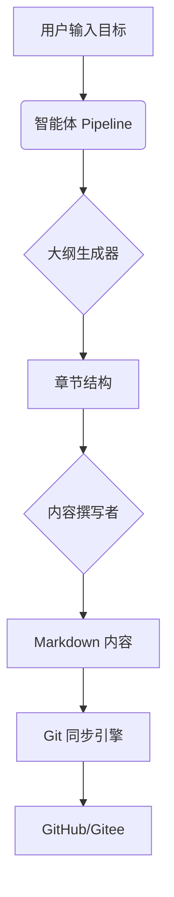

# Doc-Forge：智能化技术文档创作助手

## 🧠 核心理念

**Doc-Forge** 是一款基于 Chrome Extension 架构的 AI 辅助写作工具。它的核心理念是：**将非结构化的想法转化为逻辑严密的专业文档**。

传统的编辑器只是记录文字，而 Doc-Forge 通过 **Agent Pipeline（智能体流水线）** 深度参与创作过程：从大纲规划、内容填充到多语言润色，实现全流程的智能化辅助。

## ✨ 为什么选择 Doc-Forge？

*   **结构化优先**：强制采用树状层级（H1-H4）管理文档，确保技术方案逻辑清晰。
*   **智能体协作**：支持自定义 AI 工作流，不同 Prompt 协同完成复杂任务。
*   **本地化与隐私**：数据存储在本地 `chrome.storage`，API Key 经过加密处理，保障信息安全。
*   **多平台同步**：内置 Git 同步引擎，支持 GitHub、Gitee、GitLab 等多平台一键推送。

## 🚀 核心功能模块

### 1. 智能大纲生成 (Outline Generator)
只需输入一个简单的目标（如“编写一个分布式锁的实现方案”），AI 即可自动生成包含多级章节的详细大纲。

### 2. 三栏式创作界面
*   **左侧导航**：实时展示文档树状结构，支持拖拽排序和折叠展开。
*   **中间编辑区**：支持 Markdown 源码与实时预览切换，内置 Token 消耗统计。
*   **右侧 AI 面板**：提供“优化”、“精简”、“扩写”等快捷指令，即时反馈 AI 建议。

### 3. 强大的配置中心
*   **Provider 配置**：支持阿里云 DashScope、OpenAI、DeepSeek、Claude、Kimi 等多个主流大模型厂商。
*   **Prompt 工程**：允许用户自定义 Role（角色定义）和 Task（任务描述），打造专属的写作专家。
*   **Agent 编排**：将多个 Prompt 串联成 Pipeline，实现自动化分步执行。

### 4. 博客元数据管理
专为 Hugo/Jekyll 等静态博客设计，支持在编辑器内直接配置 `categories`、`tags`、`description` 及草稿状态。

## 🛠 技术栈

*   **Chrome Extension (Manifest V3)**
*   **React + Lucide Icons**
*   **Local Storage & Encryption**
*   **Markdown Rendering Engine**

---

Doc-Forge 致力于让技术写作变得像写代码一样严谨且高效，是每一位开发者构建知识库的得力助手。

## 📊 架构图示例 (Mermaid)

